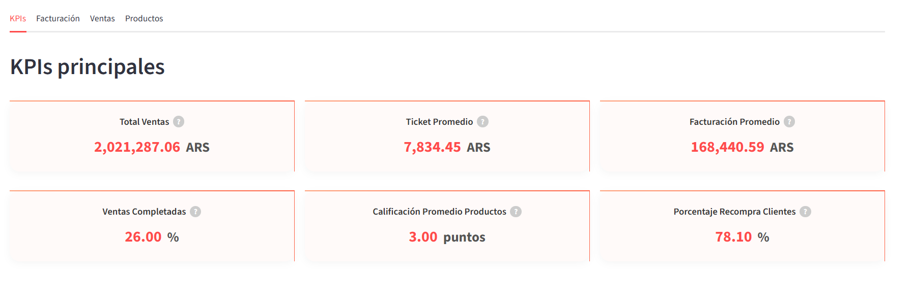
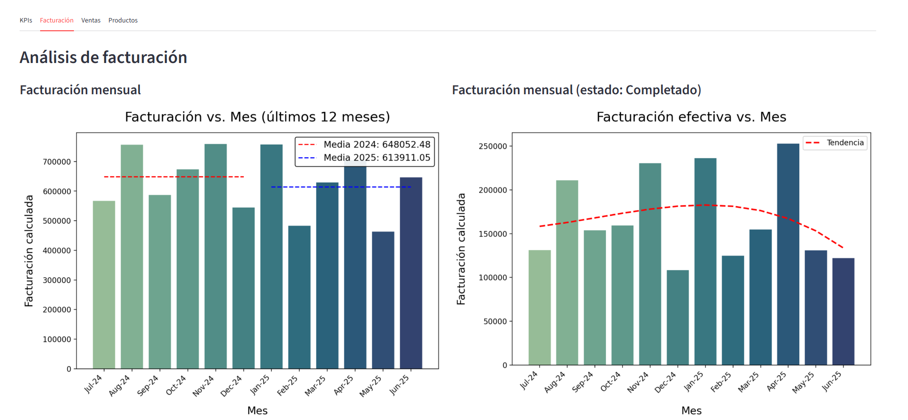
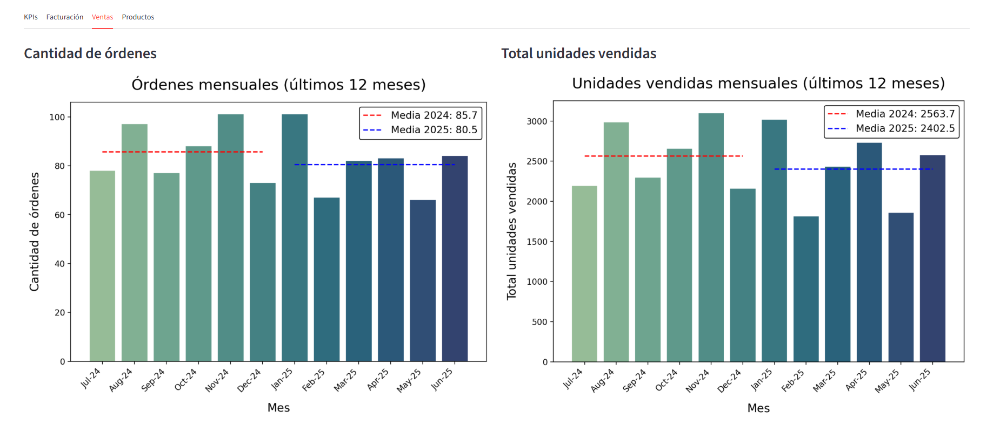
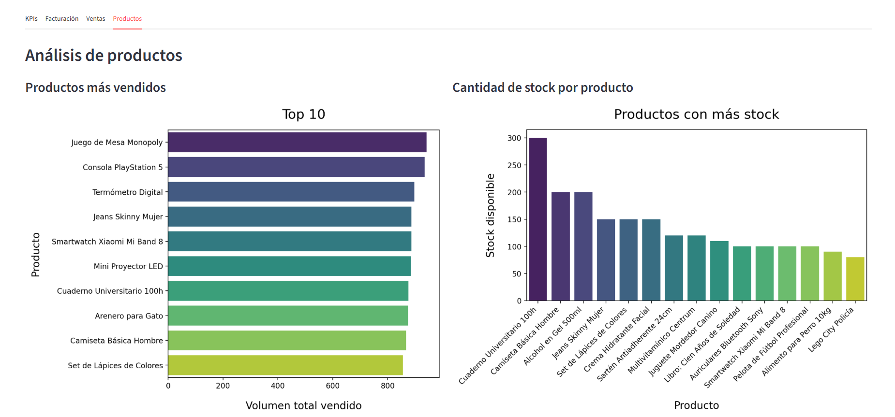

# M2: EcommerceDB - PostgreSQL, SQLAlchemy, DBT y Streamlit

Se modela una base de datos para un comercio electrónico. 

Se utilizan las siguientes tecnologias: 
    - **SQLAlchemy** para mediar la creación de esquemas
    - **PostgreSQL** de motor de base de datos 
    - **DBT** como herrmienta para hacer ELT
    - **Streamlit** para presentación de los resultados

---

## Tecnologías utilizadas

- Python y libss
- Docker 
- PostgreSQL
- SQLAlchemy
- DBT 
- Streamlit

---

## Estructura del Proyecto

```
├── dash/                        # Aplicación frontend (dashboard)
├── data/                        
├── mi_proyecto_dbt/             
├── orm/                         # Interacción con la base de datos
│   ├── scripts_sql/             # Scripts SQL para creación de tablas e inserción de datos
│   │   ├── 1.Create_ddl.sql     # Script de creación de estructura base
│   │   ├── 2.usuarios.sql       # Tabla de usuarios
│   │   ├── 3.categorias.sql     # Tabla de categorías
│   │   ├── ...                  # etc etc
│   ├── db_conector.py           # Conexión a la bd
│   ├── main.py                  # Script ppal de ejecución
│   └── modelos.py               # Definición de modelos vía ORM
├── pgadmin-data/sessions/       
├── proyecto_dbt/                # Proyecto principal de DBT
│   ├── logs/                    
│   ├── models/                  # Modelos para transformaciones DBT
│   ├── target/                  # Archivos generados tras compilación DBT
│   └── dbt_project.yml          # Config del proyecto DBT
├── .gitignore                   
├── Dockerfile                   
├── README.md                    
├── docker-compose.yml           # Orquestación de servicios 
├── requirements.txt             
```

---

## Para ejecutar el proyecto

1. Clonar el repo 
2. Crear entorno virtual
3. Instalá las dependencias

## Despliegue 

1. Crear archivo .env para variables de entorno
2. Ejecutar 

```bash
docker-compose up -d
```
3. BD 
- Acceder a PostgreSQL --> `localhost:5432`
- PgAdmin --> `http://localhost:8080`

---

# main.py – Script para ejecución inicial

main.py crea e inserta los datos necesarios en PostgreSQL
Utiliza conjunto de archivos `.sql` del directorio `scripts_sql`.

1. **Creación de tabla**  
   Se corre el script `1.Create_ddl.sql` para generar las tablas necesarias.

2. **Cargar de datos**  
   Se ejecutan en secuecnia una lista de scripts `.sql`.

## Ejecución

```bash
python main.py
```

### Modelado con DBT

1. Ejecutar los siguientes comandos dentro de /proyecto_dbt

```bash
dbt run
dbt test
dbt docs generate
```

dbt docs serve --port 8081
Para levantar un servidor local y ver la documentación generada --> http://localhost:8081.

### Documentacion DBT


--- 

## Dashboard

Se creo un dashboard con Streamlit, el cual se alimenta con los datos obtenidos los modelos y transformaciones relaizadas con DBT.
El mismo, esta dividido en cuatro tabs:
- KPIs
    - 6 KPIs a modo de resumen general
- Facturación
    - Facturación vs. tiempo
- Ventas
    - Ventas vs. tiempo
- Productos
    - Productos


### Tab KPIs


### Tab Facturación
Se presentan varios gráficos. 

* Facturación vs. tiempo
* Facturación efectiva vs. tiempo (facturas con estado="Completado")
* Volumen de ventas por categoría
* Facturación por categoría





### Tab Ventas
Varios gráficos que relación alguna medida de ventas con distintas variables.

* Cantidad de órdenes vs. tiempo
* Unidades vendidas vs. tiempo



### Tab Productos
Varios gráficos que relacinan alguna característica de prodcutos con distintas variables.

* Top 10 ventas
* Stock 




### Dashboard live

1. cd /dash
2. Correr con streamlit el dash_streamlilt.py

```bash
streamlit run dashboard_streamlit.py
```
